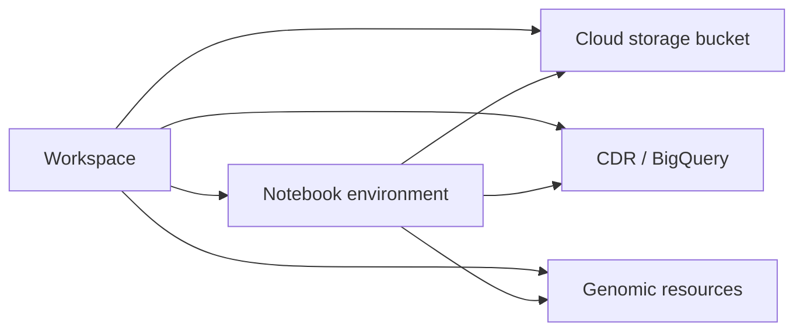

# Understanding the Workspace

10 minutes
Beginner

## When should I read this?

Read this page when you are entering an AoU workspace for the first time or are unsure how notebooks, cloud environments, BigQuery, buckets, and datasets relate to one another.

## What you will learn

- The role of the workspace
- Where code executes
- Where files are stored
- How structured and genomic data are accessed
- Which resources continue to generate costs

## Core mental model

## Validation checkpoint

Before starting an analysis, confirm that you can identify:

- your workspace name;
- your active cloud environment;
- the workspace bucket path;
- the CDR version;
- the location of any genomic resource you plan to use.
